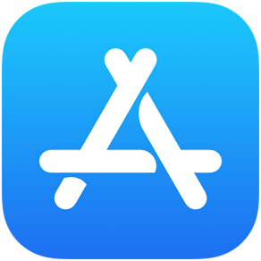
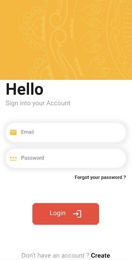
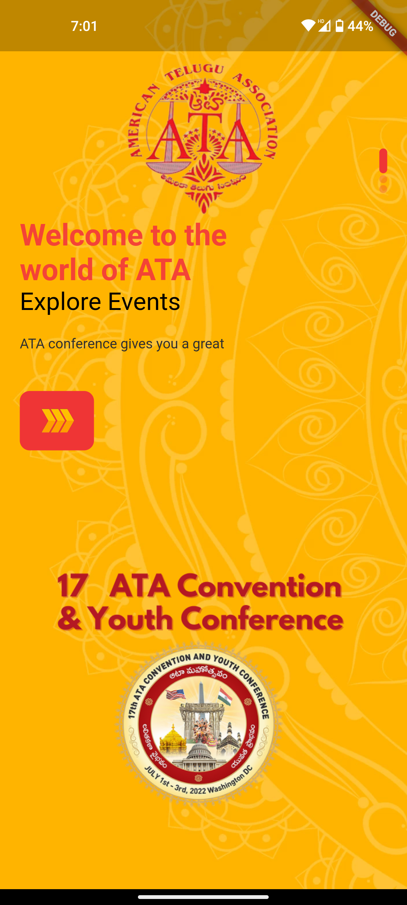
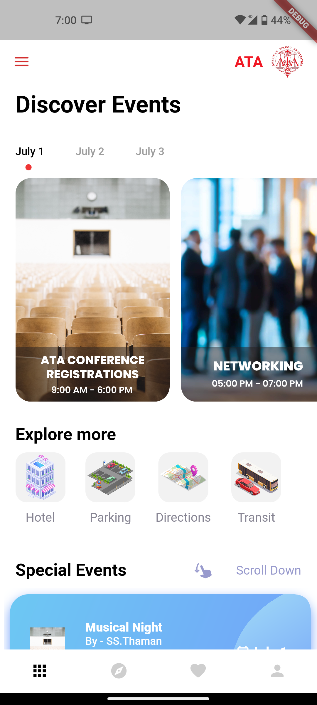
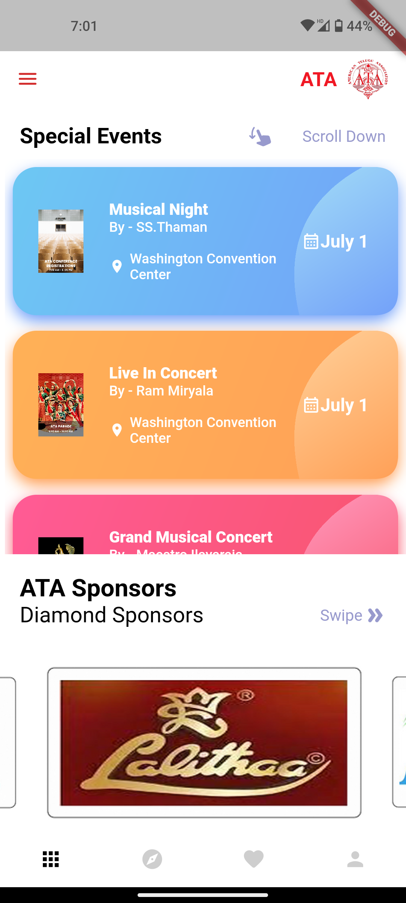
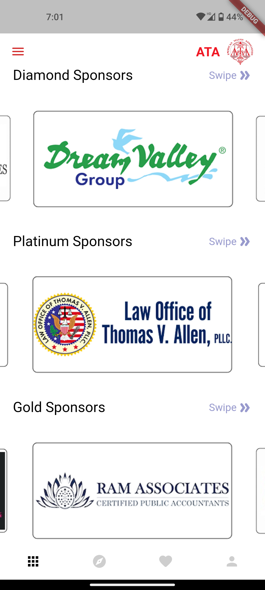
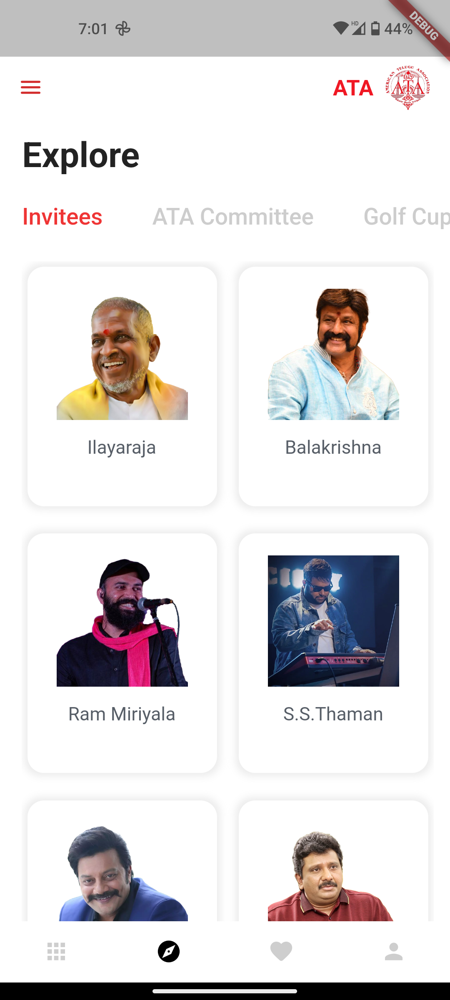
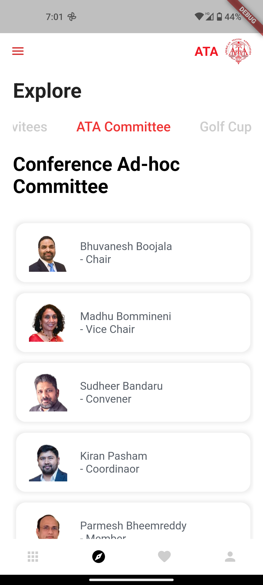

# ATA Conference App
## Event Application

ATA is a national Organisation of Telugu speaking people in USA. The main purpose of the Organisation is to assist and promote literary, cultural, educational, social, economic, health and community activities of the people of Telugu origin as well as to promote exchange programs for students, scientists, and professionals of Telugu origin between the United States of America, Canada and India and other countries. ATA holds annual conferences every year to promote unity and integrity of the Telugu community 

## To Download Application 
 <kbd> > IOS : <a href="https://apps.apple.com/in/app/ata-conference/id1626614201">Click here to Download</a></kbd>
> IOS : <a href="https://apps.apple.com/in/app/ata-conference/id1626614201">Click here to Download</a>  
> Android : <a href="https://play.google.com/store/apps/details?id=com.ataevents.intAppone">Click here to Download </a>

## Table of Contents

* [Motive](#motive)
* [Features](#features)
* [Technologies](#tech)
* [App Preview](#ata-conference)
  * [User Login Screen](#user-login-screen)
  * [Welcome Screen](#welcome-screen)
  * [Home Screen](#home-screen)
  * [Events Screen](#explore-events-screen)

## Motive
- To develop a simpler event flow application for the users.
- To provide the event schedule, information and ratings for each and every individual programs.

## Features

ATA Conference App mainly focuses on :
- The people will have well organised and simpler user-flow to find the events.
- Detailed description pages for each individual event.
- The registered users will have an access to rate each events individually.
- Authorities will get the access to the registration details and the average rating for each event.
- Information & complete detail about the event and access to the resources by the ATA Organisation. 

## Tech

This App uses Google Tecnologies :

- [Flutter](https://flutter.dev/docs) - Google’s UI toolkit for building beautiful, natively compiled applications for mobile, web, and desktop from a single codebase.
- [Firebase](https://firebase.google.com/docs) -  Google's mobile platform that helps you quickly develop high-quality apps
- [Android](https://codelabs.developers.google.com/?authuser=1) - Mobile Operating System 

# ATA Conference

## User Login Screen
 <kbd></kbd>

## Welcome Screen
 <kbd></kbd>
 
## Home Screen
 <kbd></kbd>
 <kbd></kbd>
 <kbd></kbd>

 ## Explore Events Screen
 <kbd></kbd>
 <kbd></kbd>

